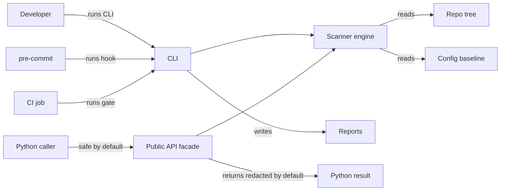

# Threat Model

## Executive Summary

`repo-sentinel-lite` is a local repository hygiene CLI and pre-commit provider.
Its main security value is deterministic detection of obvious suspicious files,
generic high-entropy strings, structured secret-adjacent patterns, missing
standard repository files, and reviewable baseline drift. Its main risk is
over-trust: it is not a replacement for enterprise secret scanning, a clean run
does not guarantee that a repository has no leaked secret or credential, and it
does not identify every credential format.

## Scope and Assumptions

In scope:

- CLI execution through `repo-sentinel scan`
- package-level Python API calls through `repo_sentinel.scan_repository`
- local repository tree traversal and text-file scanning
- `.reposentinel.toml` configuration
- `.reposentinel-baseline.json` suppression behavior
- pre-commit provider hooks and CI reuse
- package metadata and release artifacts

Out of scope:

- organization-wide secret inventory or revocation
- live repository hosting controls
- enterprise policy enforcement, dashboards, or centralized triage
- semantic code analysis or full SAST
- historical Git scanning beyond the checked-out working tree

Assumptions:

- The tool is run locally or in CI against a checked-out repository.
- The tool does not expose a network service.
- The tool does not report findings to a remote backend.
- Reviewers treat baseline changes as security-adjacent changes.
- If a real secret is committed, rotate or revoke it even if it is later
  redacted, baselined, or removed from the working tree.

Explicit non-goals:

- `repo-sentinel-lite` is not a replacement for enterprise secret scanning.
- A passing scan does not guarantee that a repository has no leaked secret,
  token, credential, or sensitive material.
- The scanner does not identify every credential format; it uses suspicious
  filenames, generic entropy, provider-prefix patterns, and assignment-context
  heuristics rather than authoritative credential validation.

Open questions that would change risk ranking:

- Whether a consumer repository stores regulated data or production secrets.
- Whether a consumer organization requires historical Git secret scanning.
- Whether CI is the only enforced gate or merely advisory.

## System Model

### Primary Components

- CLI entry point: `src/repo_sentinel/cli.py`
- secure-default Python facade: `src/repo_sentinel/api.py`
- Scanner facade: `src/repo_sentinel/scanner.py`
- Rule definitions: `src/repo_sentinel/rules/`
- Baseline matching and audit: `src/repo_sentinel/baseline.py`
- Report formatting: `src/repo_sentinel/report.py` and
  `src/repo_sentinel/sarif.py`
- Configuration file: `.reposentinel.toml`
- Default baseline file: `.reposentinel-baseline.json`
- Pre-commit provider manifest: `.pre-commit-hooks.yaml`
- CI and release validation: `.github/workflows/ci.yml` and
  `.github/workflows/pre-commit-provider.yml`
- Package metadata: `pyproject.toml`

### Data Flows and Trust Boundaries

- Developer shell -> CLI: command-line arguments choose the target path,
  output format, baseline path, and failure mode. The channel is local process
  execution; validation is limited to path existence, directory checks, config
  parsing, and allowed enum values.
- Pre-commit or CI -> CLI: hooks invoke `repo-sentinel scan
  --fail-on-severity ... .` from `.pre-commit-hooks.yaml`. The channel is local
  process execution inside the consumer repository or CI job.
- Python caller -> package facade: `repo_sentinel.scan_repository` returns a
  deep-redacted report by default. Explicit `reveal_secrets=True` crosses into
  the sensitive in-memory report contract.
- CLI -> repository tree: scanner walks files, ignores configured/default
  paths, reads likely text files, and applies filename, entropy, and structured
  secret-adjacent heuristics.
- CLI -> config and baseline: scanner reads `.reposentinel.toml` and baseline
  JSON. Config changes can narrow or widen scan coverage; allowlist entries
  can suppress findings before output; baseline entries can suppress current
  findings.
- CLI -> report outputs: scanner emits JSON, text, SARIF, or baseline JSON.
  High-entropy token bodies are redacted by default unless `--reveal-secrets`
  is used.

#### Diagram

## Assets and Security Objectives

| Asset | Why it matters | Security objective |
| --- | --- | --- |
| Repository source and fixtures | May accidentally include secrets or sensitive files | Confidentiality, integrity |
| High-entropy token bodies | May be real credentials even when detected heuristically | Confidentiality |
| Baseline JSON | Suppresses findings and can hide reviewed risk if abused | Integrity |
| `.reposentinel.toml` | Changes scan coverage, thresholds, and allowlists | Integrity |
| CI/pre-commit gate | Provides adoption evidence and enforcement | Integrity, availability |
| Package metadata and hooks | Controls how consumers install and invoke the tool | Integrity |

## Attacker Model

### Capabilities

- Submit or modify files in a repository under review.
- Propose changes to `.reposentinel.toml`, `.reposentinel-baseline.json`, or
  `.pre-commit-config.yaml`.
- Add secrets that do not look like high-entropy strings or suspicious
  filenames.
- Encourage reviewers to treat a clean scan as complete secret assurance.
- Cause logs to include full token bodies if maintainers run
  `--reveal-secrets` and publish the output.

### Non-Capabilities

- The tool does not provide a network listener or remote API to attack.
- The tool does not exfiltrate findings to a backend.
- The tool does not rotate, revoke, validate, or inventory credentials.
- The tool does not inspect all Git history unless a caller separately checks
  out historical states and scans them.

## Entry Points and Attack Surfaces

| Surface | How reached | Trust boundary | Notes | Evidence |
| --- | --- | --- | --- | --- |
| CLI arguments | `repo-sentinel scan ...` | Developer shell to CLI | Controls paths, baselines, output, and failure behavior | `src/repo_sentinel/cli.py` |
| Python API | `repo_sentinel.scan_repository(...)` | Caller code to package facade | Redacted by default; explicit reveal returns sensitive token bodies | `src/repo_sentinel/api.py` |
| Repository files | Scanner walks target path | Repo content to scanner | Filename, entropy, and structured heuristics are intentionally lightweight | `src/repo_sentinel/rules/` |
| `.reposentinel.toml` | Loaded from target root | Repo config to scanner | Ignore globs, thresholds, and allowlists can reduce coverage | `src/repo_sentinel/config.py` |
| `.reposentinel-baseline.json` | Auto-loaded from target root | Repo baseline to scanner | Matching findings are suppressed before failure decisions | `src/repo_sentinel/baseline.py` |
| Pre-commit hooks | Consumer config invokes provider | Developer/CI hook runner to CLI | Hooks scan repository root with severity gates | `.pre-commit-hooks.yaml` |
| CI package checks | GitHub Actions builds/tests package | CI to package artifacts | Validates metadata and package shape, not secret absence | `.github/workflows/ci.yml` |

## Top Abuse Paths

1. Attacker adds a credential format that is low-entropy or uncommon, the scan
   passes, and reviewers mistake the pass for proof that no secret exists.
2. Attacker adds broad ignore globs or allowlists to `.reposentinel.toml`,
   sensitive paths or rules are skipped, and CI still reports success.
3. Attacker adds a baseline entry for a real finding, reviewers do not inspect
   the baseline drift, and future runs suppress the finding.
4. Maintainer uses `--reveal-secrets` while debugging, stores output in logs or
   artifacts, and exposes the token body outside local review.
5. Python caller opts into `reveal_secrets=True`, serializes the sensitive
   report as routine telemetry, and exposes credential-like token bodies.
6. Consumer pins an old provider revision or disables the hook in CI, then
   assumes pre-commit coverage still matches current documentation.
7. Team scans only the current working tree after a secret was removed from
   head, misses the same secret in Git history, and treats the repository as
   remediated without rotation.

## Threat Model Table

| Threat ID | Threat source | Prerequisites | Threat action | Impact | Impacted assets | Existing controls | Gaps | Recommended mitigations | Detection ideas | Likelihood | Impact severity | Priority |
| --- | --- | --- | --- | --- | --- | --- | --- | --- | --- | --- | --- | --- |
| TM-001 | Contributor or maintainer misunderstanding | Reviewers rely on `repo-sentinel-lite` as complete secret assurance | Treat clean output as proof that no credentials leaked | Missed secret remains in repository or history | Repository content, credentials | README and docs describe lightweight scanning | No provider-specific credential parsers or historical scan | State non-goals clearly; pair with enterprise secret scanning for production repos | Review docs and PR templates for overclaiming | Medium | High | High |
| TM-002 | Contributor changing baseline | Baseline changes are accepted without review | Suppress a real finding through `.reposentinel-baseline.json` | Gate passes while risky content remains | Baseline JSON, credentials | Baseline guide says baselines are reviewed suppressions | Baseline cannot prove safety | Require baseline diff review and explanations for added entries | Alert on baseline file changes in PRs | Medium | Medium | Medium |
| TM-003 | Contributor changing config | Ignore globs, thresholds, or allowlists are broadened | Exclude sensitive paths from traversal or suppress rules before output | Scanner misses files or findings it would otherwise inspect | Config, repository content | Config is explicit in `.reposentinel.toml`; allowlist supports path, rule, token-hash, and scoped-comment exceptions | No policy engine for safe ignore or allowlist patterns | Treat config changes like security changes; prefer token-hash or scoped exceptions over broad rule suppressions | Review `.reposentinel.toml` diffs in CI/PRs; audit baseline drift | Medium | Medium | Medium |
| TM-004 | Maintainer debugging locally | `--reveal-secrets` output is copied to logs or artifacts | Full high-entropy token body is exposed | Real credential leaks through diagnostics | Token bodies, reports | Redaction is default in CLI and baselines | Explicit reveal option can still expose secrets | Use `--reveal-secrets` only locally; never commit or upload revealed output | Search artifacts for raw token-like strings | Low | High | Medium |
| TM-007 | Python integration author | Caller explicitly requests revealed results | Sensitive in-memory report is logged or persisted as ordinary telemetry | Credential-like token bodies leave the local investigation boundary | Token bodies, reports | Package-level API deep-redacts by default | Explicit reveal remains necessary for some investigations | Keep reveal opt-in; label the returned object sensitive; test the package-level default | Scan logs and artifacts for raw token-like strings | Low | High | Medium |
| TM-005 | Consumer integration drift | Hook is not installed, old rev is pinned, or CI does not run it | Expected gate is absent or stale | Findings are not blocked before merge | CI/pre-commit gate, package hooks | Provider manifest and integration guide document hooks | Consumer repos control their own config | Pin release tags, run hook in CI, review hook updates | CI status checks for hook execution | Medium | Medium | Medium |
| TM-006 | Incident response gap | Secret was committed and then removed from current tree | Current scan passes but history still contains the credential | Credential remains usable or discoverable in history | Credentials, Git history | Docs say redaction/history cleanup do not replace revocation | Tool scans checked-out tree, not all history | Rotate/revoke real secrets; use history scanning tools when needed | Enterprise scanners and audit logs | Medium | High | High |

## Criticality Calibration

- Critical: a change claims the tool guarantees no leaks; release artifacts
  expose real credentials; CI publishes revealed secret output.
- High: real credentials remain in Git history after a clean head scan;
  docs imply this tool replaces enterprise secret scanning; broad config
  exclusions hide sensitive paths in production repositories.
- Medium: reviewed baseline entries lack explanations; hook integration drifts
  from documented behavior; warning-level hygiene findings are not enforced.
- Low: local-only false positives, missing standard files in experimental repos,
  or documentation examples that need clearer wording.

## Focus Paths for Security Review

| Path | Why it matters | Related Threat IDs |
| --- | --- | --- |
| `src/repo_sentinel/api.py` | Owns the secure-default boundary for programmatic callers | TM-004, TM-007 |
| `src/repo_sentinel/rules/` | Contains rule semantics and heuristic detector boundaries | TM-001, TM-003 |
| `src/repo_sentinel/config.py` | Applies ignore and allowlist policy | TM-003 |
| `src/repo_sentinel/baseline.py` | Applies baseline suppression and audit classification | TM-002, TM-004 |
| `src/repo_sentinel/cli.py` | Wires baseline suppression before output and failure decisions | TM-002, TM-004 |
| `.pre-commit-hooks.yaml` | Defines provider hook arguments and scan scope for consumers | TM-005 |
| `docs/baseline-review.md` | Sets reviewer expectations for suppression and drift | TM-002, TM-003 |
| `docs/pre-commit-integration.md` | Sets consumer expectations for hook and CI reuse | TM-005 |
| `README.md` | First-screen public claims must avoid over-promising secret assurance | TM-001 |
| `.github/workflows/ci.yml` | Validates package metadata and public release posture | TM-005 |

## Notes on Use

Use `repo-sentinel-lite` as a deterministic, local hygiene gate. For production
or regulated repositories, pair it with organization-approved enterprise
secret scanning, credential inventory, revocation workflows, historical Git
scanning, and incident response procedures.
